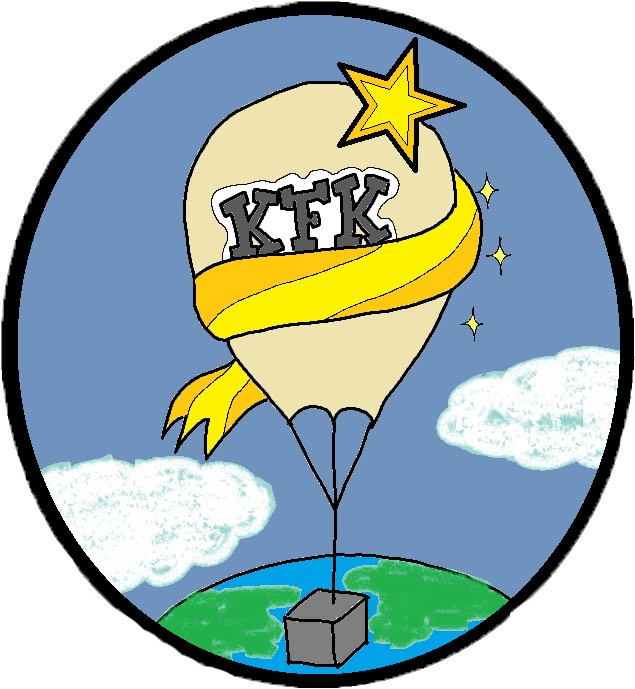

# Stratoballoon
**Codebase for high-altitude balloon simulation**

[KFK high-altitude balloon mission website](http://comodi.phys.ubbcluj.ro:8091/)

The Club of Young Physicists from Babes-Bolyai University of Cluj-Napoca (Kolozsvári Fizikus Klub - KFK) within the framework of it's latest project set the goal of launching a high-altitude balloon into the Stratosphere. The aim of the high-altitude balloon is to deliver a measuring equipment to the Stratosphere (approximately 20 km above sea level), which contains a set of different sensors to collect atmospheric data.  

This repository holds our code used to simulate vertical and horizontal displacements of the balloon based on simple models and weather forecast data from [NCEP](https://psl.noaa.gov/data/gridded/data.ncep.reanalysis.html).

### References 
[A Scientific Mission Based on a High Altitude Stratospheric Balloon](http://article.sapub.org/10.5923.j.aerospace.20140301.03.html)

